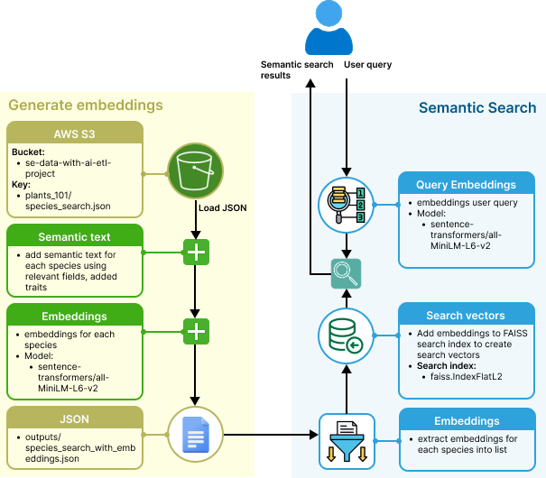
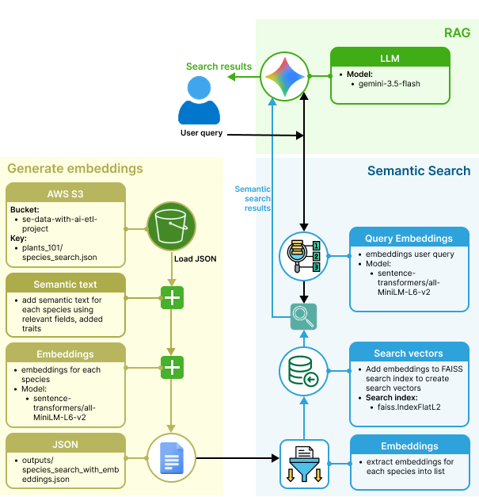

## Introduction

### Concept
The concept of this project was to build a data pipeline that retrieves data from an API, transforms it, and loads it for use in a search and recommendation system enhanced with semantic search and RAG.

<br>


<br>

### Goals
🌱 Build a successful ETL pipeline using plant data from an external API <br>
🌱 Make plant information easier for users to discover <br>
🌱 Allow users to search using natural language rather than exact plant names <br>
🌱 Recommend plants based on what the user is looking for <br>
🌱 Provide useful, data-driven answers through RAG <br>

<br>

### Why this dataset?

|  **Interest** |  **Data Structure** |  **Potential** |
|---|---|---|
| Our group has a shared interest in houseplants. | The API provides a wide range of plant and care information in a semi-structured format. | This gave us the opportunity to clean and transform real-world data, while also supporting semantic search, recommendations and RAG. |

<br>

### Setup

Create and activate a virtual environment:

```bash
python3 -m venv .venv
source .venv/bin/activate
```

Install the project dependencies:

```bash
pip install -r requirements.txt
```

Create a `.env` file in the project root, add your API keys and AWS profile if not `default` :

```env
PERENUAL_API_KEY=your_real_perenual_api_key
GEMINI_API_KEY=your_real_gemini_api_key
AWS_PROFILE=your_aws_profile(if not default)
```

Run the application:

1. ETL pipeline

```bash
python3 etl.py
```

2. Semantic search 

```bash
python3 semantic_search.py
```

3. RAG (Terminal application)

```bash
python3 rag_search.py
```

4. RAG (Web UI)

```bash
python3 app.py
```

Check the terminal messages for the `localhost` port the website is available on. 

For Example
```
* Running on http://127.0.0.1:5000
```

> **Note**
>
> - `.env` file contains a secret and should not be committed to Git.

<br>

## Processes
### ETL Pipeline
The project implements a complete ETL pipeline to retrieve plant data from an external API, clean and transform the data, and load the resulting dataset into an AWS S3 bucket for downstream search and RAG applications.

<br>


<br>

The project implements a complete ETL pipeline to retrieve plant data from an external API, clean and transform the data, and load the resulting dataset into an AWS S3 bucket for downstream search and RAG applications.

<br>

### API Endpoints

The plant data was extracted from two Perenual API endpoints:

🌱 Species list: `https://perenual.com/api/v2/species-list` <br>
🌱 Species detail: `https://perenual.com/api/v2/species/details/[ID]`


> **Extraction considerations**
>
> - **30 plants per page** from the species-list endpoint.
> - **Separate API request** required for each plant's detailed information.
> - **100 API requests/day limit**, so data extraction had to be incremental.
>   - Pipeline **tracks the last page and plant processed** to resume across multiple runs.
>   - Raw API data is stored in **MongoDB** in separate species and detail collections.
>   - A **metadata collection tracks extraction progress and history**.
>   - This makes the pipeline **resumable and repeatable** without losing previously collected data.


<br>

### Transform

The transformations included:

🌱 Removing unnecessary whitespace and duplicate list values. <br>
🌱 Standardising categorical values such as sunlight, watering, soil and maintenance. <br>
🌱 Converting numeric values, such as hardiness ratings, from strings to numbers. <br>
🌱 Converting watering ranges into structured numeric fields. <br>
🌱 Removing API subscription messages, credentials, unnecessary URLs and HTML that did not describe the plant. <br>
🌱 Preserving missing values as `null` rather than replacing them with misleading defaults. <br>
🌱 Keeping the species and detailed species datasets separate while preserving their relationship through plant IDs. <br>

For a detailed explanation of the cleaning decisions and their rationale, see [`rationale.md`](rationale.md).

The cleaned dataset is then stored in a `species_search` collection in MongoDB.

<br>

### Load

- `species_search` collection from MongoDB is exported as JSON to `outputs/species_search.json`

- The resulting JSON dataset is then uploaded to AWS S3

🌱 **S3 Bucket:** `se-data-with-ai-etl-project` <br>
🌱 **Key:** `plants_101/species_search.json` <br>


This provides the processed dataset as a reusable input for the downstream semantic search and RAG components.

<br>

### Semantic Search

The semantic search component builds on the cleaned `species_search` dataset generated from ETL pipeline by creating a representation of each plant that can be used for meaning-based search rather than relying solely on exact keyword matches.

The semantic search dataset is designed to sit between the ETL pipeline and the downstream AI applications, turning the cleaned plant data into a representation that can be searched based on meaning.

The goal was to allow users to describe what they are looking for in natural language, such as:

> *"A low-maintenance indoor plant that doesn't need much sunlight."*

<br>



<br>


#### Dataset preparation

🌱 For each plant, a `semantic_text` field was created containing the most useful natural-language information about the plant.<br>
🌱 Structured fields were retained separately from `semantic_text`. This allows the system to distinguish between:<br>
    - **Semantic information** that are useful for understanding the meaning of a query.<br>
    - **Structured metadata** that can be used for filtering or refining search results.<br>

This separation provides the foundation for combining semantic similarity with traditional metadata filtering.

#### Embeddings

🌱 The `semantic_text` for each plant is converted into a numerical vector representation called an **embedding**.

🌱 Model used:
    - `sentence-transformers/all-MiniLM-L6-v2`


> **Considerations when generating embeddings**
>
> - Dynamically generating embeddings using `sentence-transformers` can be slow and negatively impact response times.
> - Embeddings are therefore generated **statically** and stored in JSON for faster retrieval.
> - This improves **search performance and overall user experience** by avoiding repeated embedding generation.

#### Vector search

🌱 Natural-language user query is also converted into an embedding using the same model.<br>
🌱 The query embedding can then be compared with the plant embeddings to identify the plants that are most semantically similar to what the user is looking for.


### RAG

The RAG component combines the semantic search system with a large language model to provide **data-driven, natural-language answers**.

🌱 The query is converted into an embedding.<br>
🌱 Relevant plant information is retrieved using semantic similarity.<br>
🌱 The retrieved data is provided to the language model as context.<br>
🌱 The model generates an answer based on the retrieved plant information.<br>


<br>



<br>

#### LLM model
🌱 gemini-3.5-flash<br>

> **LLM considerations**
>
> - **Gemini 3.5 Flash** was selected for its balance of **capability, speed and cost**, making it well suited to this RAG application.
> - Gemini provides a **free API tier with free input and output tokens** for supported models, making it suitable for a project where API costs need to be minimised.
> - OpenAI and Anthropic also provide developer APIs, but their standard API usage is primarily **usage-based and paid**, with more limited free credits or trials.
> - **Ollama** was considered as a local alternative. While it avoids API costs, it requires local hardware to run the model and can introduce additional performance and setup requirements.


## Lessons learnt
## Future enhancements
## Strong for employers

## Conclusion

