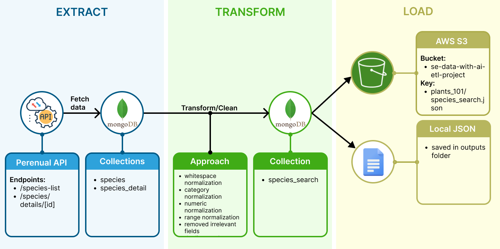

## Introduction

### Concept
The concept of this project was to build a data pipeline that retrieves data from an API, transforms it, and loads it for use in a search and recommendation system enhanced with semantic search and RAG.

<br>


<br>

### Goals
🌱 Build a successful ETL pipeline using plant data from an external API <br>
🌱 Make plant information easier for users to discover <br>
🌱 Allow users to search using natural language rather than exact plant names <br>
🌱 Recommend plants based on what the user is looking for <br>
🌱 Provide useful, data-driven answers through RAG <br>

<br>

### Why this dataset?

|  **Interest** |  **Data Structure** |  **Potential** |
|---|---|---|
| Our group has a shared interest in houseplants. | The API provides a wide range of plant and care information in a semi-structured format. | This gave us the opportunity to clean and transform real-world data, while also supporting semantic search, recommendations and RAG. |

<br>

### Setup

Create and activate a virtual environment:

```bash
python3 -m venv .venv
source .venv/bin/activate
```

Install the project dependencies:

```bash
pip install -r requirements.txt
```

Create a `.env` file in the project root and add your Perenual API key:

```env
PERENUAL_API_KEY=your_real_perenual_api_key
GEMINI_API_KEY=your_real_gemini_api_key
AWS_PROFILE=your_aws_profile(if not default)
```

Run the application:

```bash
python main.py
```

The `.env` file contains a secret and should not be committed to Git.

<br>

## Processes
### ETL Pipeline
<br>



<br>

The project implements a complete ETL pipeline to retrieve plant data from an external API, clean and transform the data, and load the resulting dataset into an AWS S3 bucket for downstream search and RAG applications.

<br>

### Extract

The plant data was extracted from two Perenual API endpoints:

🌱 Species list: `https://perenual.com/api/v2/species-list` <br>
🌱 Species detail: `https://perenual.com/api/v2/species/details/[ID]`


> **Extraction considerations**
>
> - **30 plants per page** from the species-list endpoint.
> - **Separate API request** required for each plant's detailed information.
> - **100 API requests/day limit**, so data extraction had to be incremental.
>   - Pipeline **tracks the last page and plant processed** to resume across multiple runs.
>   - Raw API data is stored in **MongoDB** in separate species and detail collections.
>   - A **metadata collection tracks extraction progress and history**.
>   - This makes the pipeline **resumable and repeatable** without losing previously collected data.


<br>

### Transform

The raw datasets were cleaned and normalized while preserving the original plant information. The transformation included:

🌱 Removing unnecessary whitespace and duplicate list values. <br>
🌱 Standardising categorical values such as sunlight, watering, soil and maintenance. <br>
🌱 Converting numeric values, such as hardiness ratings, from strings to numbers. <br>
🌱 Converting watering ranges into structured numeric fields. <br>
🌱 Removing API subscription messages, credentials, unnecessary URLs and HTML that did not describe the plant. <br>
🌱 Preserving missing values as `null` rather than replacing them with misleading defaults. <br>
🌱 Keeping the species and detailed species datasets separate while preserving their relationship through plant IDs. <br>

For a detailed explanation of the cleaning decisions and their rationale, see [`rationale.md`](rationale.md).

The cleaned dataset is then stored in a `species_search` collection in MongoDB.

<br>

### Load

The cleaned `species_search` collection from MongoDB is exported as JSON to:

`outputs/species_search.json`

The resulting JSON dataset is then uploaded to AWS S3:

🌱 **S3 Bucket:** `se-data-with-ai-etl-project` <br>
🌱 **Key:** `plants_101/species_search.json` <br>

This provides the processed dataset as a reusable input for the downstream semantic search and RAG components.

<br>

### Semantic Search

A separate `semantic_search` dataset was then created by logically joining the cleaned datasets. Each plant was represented using a natural-language `semantic_text` field for embeddings, alongside structured metadata for exact filtering. This creates a dataset suitable for semantic search, vector search and future hybrid search.

### RAG

## Lessons learnt
## Future enhancements
## Strong for employers

## Conclusion

